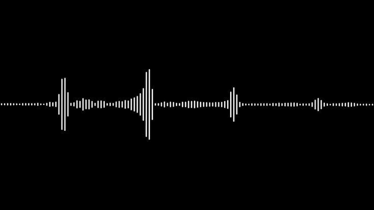

<div align="center">

</div>
<div align="center">
  
<p> </p>

</div>

## - Objetivo 🛠️

Este projeto foi criado com objetivo de ler arquivos de texto.

## - Tecnologias 🚀️

Neste projeto eu usei **gtts** para converter o texto em áudio e o **playsound** para tocar o áudio.

## - Como configurar 🧑‍💻

Primeiro clone este projeto usando:

```
git clone https://github.com/LuanCarvalho0/leitor-de-texto
```

Depois disso, abra seu terminal na pasta do projeto e execute:

```
pip install -r requisitos.txt
```

Depois disso é só executar o arquivo python e tudo deve estar funcionando! 👌
